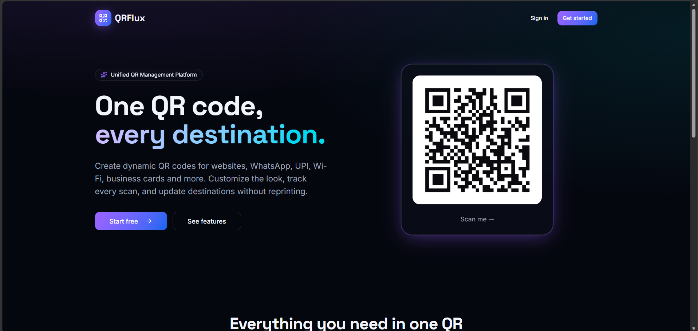
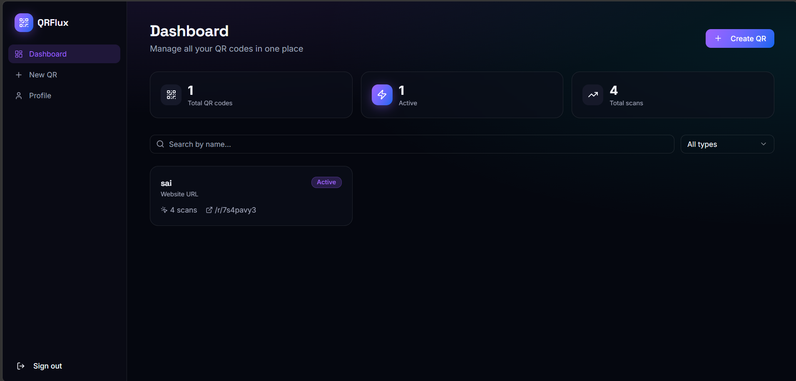
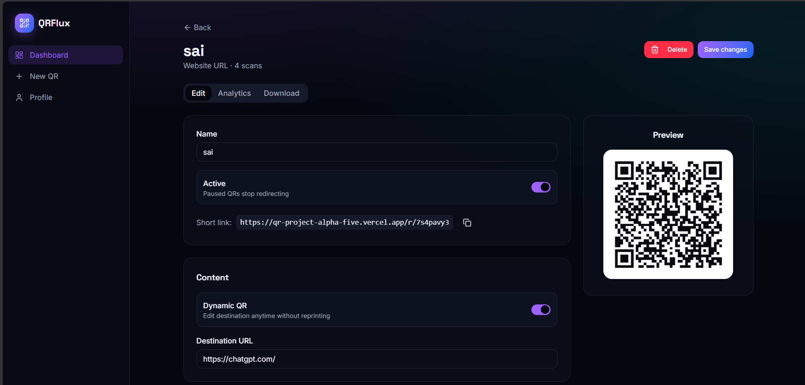

# QRFlux

**One QR code, every destination.**

QRFlux is a full-stack QR code platform — not just a generator. Create dynamic and static QR codes for websites, WhatsApp, UPI payments, Wi-Fi, digital business cards, bio-link pages, and more. Customize colors, track every scan, and update destinations without ever reprinting a code.

🔗 **Live demo:** [qr-project-alpha-five.vercel.app](https://qr-project-alpha-five.vercel.app)

---

## 📖 Project Overview

QRFlux lets a signed-in user generate, style, and manage QR codes from a single dashboard. Each QR code can point to a static payload (encoded directly into the image) or a **dynamic** destination that can be changed at any time without regenerating the code — because the QR itself just points to a short redirect link (`/r/:slug`) that QRFlux resolves server-side.

Beyond simple redirects, two QR types render their own hosted pages instead of forwarding elsewhere:
- **Multi-Link** — a bio-page style landing page listing multiple links.
- **Digital Business Card** — a vCard contact page with a "Save contact" button.

Every scan (user agent + referrer) is logged, and the dashboard surfaces total scans and active/paused counts per code.

## ✨ Features

- **11 QR code types** — Website URL, Multi-Link (bio page), Digital Business Card (vCard), WhatsApp, Phone Call, SMS, Email, Wi-Fi, UPI Payment, Google Maps, and Plain Text.
- **Dynamic QR codes** — change the destination of a URL, multi-link, or vCard QR at any time without reprinting.
- **Static QR codes** — payload encoded directly into the image for content that never changes.
- **Scan analytics** — every scan logged with user agent and referrer; dashboard shows total scans and active code counts, plus a scan trend chart per QR code.
- **Custom styling** — per-code foreground/background colors.
- **Export options** — download any QR code as PNG or SVG.
- **Hosted landing pages** — Multi-Link and vCard QR types render a live mobile-friendly page instead of a raw redirect.
- **Authentication** — email/password sign-in and sign-up via Supabase.
- **Full QR CRUD** — create, edit, pause/activate, and delete QR codes.
- **Profile management** — update display name and avatar (URL-based).
- **Row-Level Security** — Postgres RLS policies ensure users only manage their own codes, while public scan redirects still work for anonymous visitors.

## 🧱 Tech Stack

| Layer | Technology |
|---|---|
| Framework | [TanStack Start](https://tanstack.com/start) (React 19, SSR) |
| Routing / Data | [TanStack Router](https://tanstack.com/router) + [TanStack Query](https://tanstack.com/query) |
| Styling | [Tailwind CSS v4](https://tailwindcss.com/) + [shadcn/ui](https://ui.shadcn.com/) (Radix UI primitives) |
| Backend / DB | [Supabase](https://supabase.com/) (Postgres, Auth, Row-Level Security) |
| QR Generation | [`qrcode`](https://www.npmjs.com/package/qrcode) |
| Forms | React Hook Form |
| Charts | Recharts |
| Build tool | Vite |
| Hosting | [Vercel](https://vercel.com/) |

## 🚀 Installation Steps

### Prerequisites
- Node.js 18+ (or [Bun](https://bun.sh/))
- A [Supabase](https://supabase.com/) project

### 1. Clone the repository

```bash
git clone https://github.com/VENKATA-SAI-CHENGA/QR-project.git
cd QR-project
```

### 2. Install dependencies

```bash
npm install
```

### 3. Set up the database

Run the SQL migrations in `supabase/migrations/` against your Supabase project (via the Supabase SQL editor or CLI):

```bash
supabase db push
```

This creates the `profiles`, `qr_codes`, and `qr_scans` tables along with their RLS policies and triggers.

### 4. Run locally

```bash
npm run dev
```

The app runs at `http://localhost:3000` (or the port shown in your terminal).

### 5. Build for production

```bash
npm run build
npm run preview
```

## 🔑 Environment Variables

Create a `.env` file in the project root:

```env
SUPABASE_PROJECT_ID=your-project-id
SUPABASE_URL=https://your-project-id.supabase.co
SUPABASE_PUBLISHABLE_KEY=your-anon-key

VITE_SUPABASE_PROJECT_ID=your-project-id
VITE_SUPABASE_URL=https://your-project-id.supabase.co
VITE_SUPABASE_PUBLISHABLE_KEY=your-anon-key
```

Add the same variables in your Vercel project settings when deploying.

## 🗂️ Folder Structure

```
QR-project-main/
├── src/
│   ├── components/
│   │   ├── qr-form.tsx        # Dynamic form fields per QR type
│   │   ├── qr-preview.tsx     # Live canvas preview + PNG/SVG export
│   │   └── ui/                # shadcn/ui component library
│   ├── lib/
│   │   ├── qr-types.ts        # QR type definitions & payload builders
│   │   └── use-auth.ts        # Auth helper hooks
│   ├── integrations/
│   │   └── supabase/          # Supabase client (browser + server)
│   └── routes/
│       ├── index.tsx          # Landing page
│       ├── auth.tsx           # Sign in / sign up
│       ├── r.$slug.tsx        # Public redirect / bio-page / vCard renderer
│       └── _authenticated/
│           ├── dashboard.tsx  # QR code list, search & filters
│           ├── qr.new.tsx     # Create a QR code
│           ├── qr.$id.tsx     # Edit a QR code + scan analytics
│           └── profile.tsx    # Account settings
├── supabase/
│   └── migrations/            # Database schema & RLS policies
├── public/
└── package.json
```

## 🗄️ Database Schema

Three core tables, all protected by Row-Level Security:

- **`profiles`** — one row per user, auto-created on signup via trigger.
- **`qr_codes`** — the QR codes themselves (type, content, styling, target URL, active/paused state, scan count).
- **`qr_scans`** — a log of every scan (user agent, referrer, timestamp) linked to a QR code.

## 📸 Screenshots

**Landing Page**


**Dashboard**


**QR Editor** (edit destination, toggle active state, live preview & short link)


## ☁️ Deployment Link

**Live app:** [https://qr-project-alpha-five.vercel.app](https://qr-project-alpha-five.vercel.app)

Deployed on **Vercel**, connected directly to this GitHub repository for automatic deploys on push.

---

## 🧭 Development Phases

**Total Phases: 5**

### Phase 1 – Planning ✅ Completed
- Requirements
- UI Planning
- Database Design
- Project Setup
- GitHub Repository

### Phase 2 – Core Development ✅ Fully Working
- Authentication (Supabase email/password sign-in & sign-up)
- Dashboard (search, filter by type/status, scan totals)
- QR CRUD (create, edit, pause/activate, delete)
- Dynamic QR (redirect-based, editable destination)
- Profile Management (name & avatar URL update) — ✅ *partially working:* avatar is a plain URL field, not a file upload

### Phase 3 – Advanced Features ✅ Fully Working
- Analytics — *working:* scan count + scan trend chart per QR code. *Pending:* geo data (country/city) columns exist in the schema but aren't populated
- QR Customization ✅ (foreground/background colors)
- Multi-Link QR ✅ (bio-link landing page)
- Digital Business Card ✅ (vCard landing page + "Save contact")
- Security ✅ (Row-Level Security policies on all tables, scoped to code owner)
- File Uploads ✅  column exists in the database, but there is no upload UI or storage bucket integration yet; logo/avatar fields are plain text URL inputs only

### Phase 4 – Optimization ✅ Fully Working
- Responsive UI ✅ (Tailwind responsive breakpoints throughout)
- Performance — basic Vite build optimizations; no additional code-splitting/caching work done yet
- Validation  — ✅form validation is currently limited to basic checks (e.g. required name field); no schema-based validation (Zod is installed but not wired into forms yet)
- Error Handling ✅ Partially working — Supabase errors surface via toast notifications and a generic fallback error page; no field-level validation messages yet
- Documentation ✅ (this README)

### Phase 5 – Deployment
- Final Testing — *pending confirmation:* run through all QR types and auth flows before final submission
- Bug Fixes — *pending:* log and fix issues found during final testing
- Production Deployment ✅ Completed (live on Vercel, see link above)
- README ✅ Completed
- Documentation ✅ Completed (this file)
- Final Submission — *pending:* your action to submit

### 🔜 Future Improvements
- Real file/image upload for QR logos and profile avatars (e.g. Supabase Storage)
- Zod-based form validation with inline field errors
- Geo-located scan analytics (country/city breakdown)
- Bulk QR code generation and CSV export
- Custom/branded short domains for redirect links
- Team/organization accounts with shared QR codes
- Usage plans & billing (the `profiles.plan` column already exists for this)

---

## 🤝 Contributing

Contributions are welcome! Please open an issue to discuss any major changes before submitting a pull request.

1. Fork the repository
2. Create a feature branch (`git checkout -b feature/my-feature`)
3. Commit your changes
4. Push to the branch and open a Pull Request


---

Built with  using TanStack Start and Supabase.
